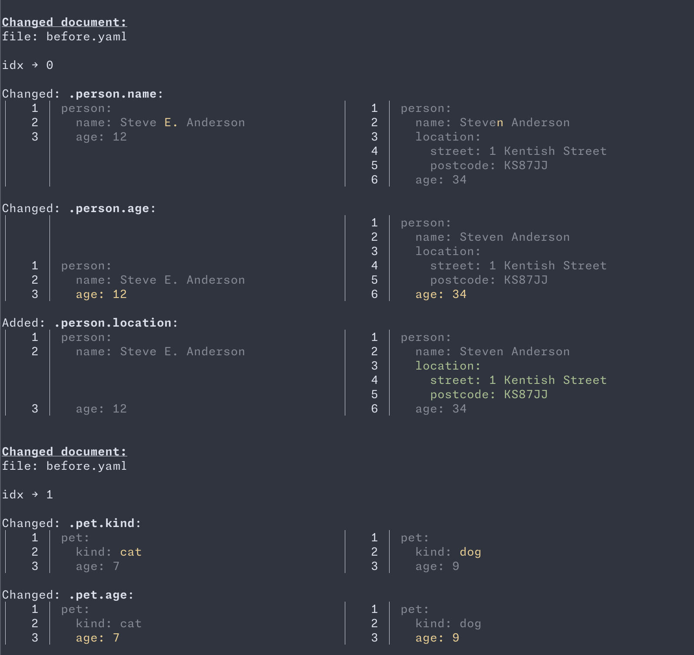

# Everdiff

A semantic diff tool for YAML documents that understands structure, not just text.

## Installation

### Homebrew

```sh
brew install felipesere/tap/everdiff
```

### From source

```sh
cargo install --path .
```

## Usage

```
everdiff [-k] [-m] [-i=PATH]... [-w] [-v]... -l=PATH... -r=PATH...

Available options:
    -k, --kubernetes    Use Kubernetes comparison
    -m, --ignore-moved  Don't show changes for moved elements
    -i, --ignore-changes=PATH  Paths to ignore when comparing
    -w, --watch         Watch the `left` and `right` files for changes and re-run
    -v, --verbose       Increase verbosity level (can be repeated)
    -l, --left=PATH     Left file(s) to compare
    -r, --right=PATH    Right file(s) to compare
    -h, --help          Prints help information
    --version           Show version information
```

## Examples

### Basic comparison

Compare two YAML files:

```sh
everdiff --left before.yaml --right after.yaml
```

Given these two files:

```yaml
# before.yaml
person:
  name: Steve E. Anderson
  age: 12
---
pet:
  kind: cat
  age: 7
```

```yaml
# after.yaml
person:
  name: Steven Anderson
  location:
    street: 1 Kentish Street
    postcode: KS87JJ
  age: 34
---
pet:
  kind: dog
  age: 9
```

The output shows semantic changes:




### Kubernetes mode

When comparing Kubernetes manifests, use `--kubernetes` to match documents by their GVK (Group/Version/Kind) and name:

```sh
everdiff --kubernetes --left before.yaml --right after.yaml
```

Documents are identified by `apiVersion`, `kind`, and `metadata.name` rather than by position:

```
Changed document:
    ╭───────────────┬───────────────────╮
    │ api_version   ┆ apps/v1           │
    ├╌╌╌╌╌╌╌╌╌╌╌╌╌╌╌┼╌╌╌╌╌╌╌╌╌╌╌╌╌╌╌╌╌╌╌┤
    │ kind          ┆ Deployment        │
    ├╌╌╌╌╌╌╌╌╌╌╌╌╌╌╌┼╌╌╌╌╌╌╌╌╌╌╌╌╌╌╌╌╌╌╌┤
    │ metadata.name ┆ flux-engine-steam │
    ╰───────────────┴───────────────────╯
Changed: .spec.replicas:
│  14 │ spec:                           │  15 │ spec:
│  15 │   replicas: 3                   │  16 │   replicas: 4
```

### Ignoring moved elements

When array elements are reordered, `everdiff` reports them as "Moved". Use `--ignore-moved` to hide these:

```sh
everdiff --kubernetes --ignore-moved --left before.yaml --right after.yaml
```

### Ignoring specific paths

Use `--ignore-changes` to exclude certain paths from the diff:

```sh
everdiff --left before.yaml --right after.yaml \
    --ignore-changes '.metadata.annotations' \
    --ignore-changes '.spec.replicas'
```

Path patterns support:
- Exact paths: `.metadata.name`
- Array indices: `.spec.containers[0].image`
- Wildcards: `.metadata.labels.*`

### Multiple input files

Compare multiple files at once:

```sh
everdiff --kubernetes \
    --left deployment.yaml service.yaml \
    --right new-deployment.yaml new-service.yaml
```

## Features

### Watch mode

When you need to keep re-running `everdiff` as you evolve a set of documents, use `--watch` to let it watch all the input files and re-run when needed:

```sh
everdiff --watch --left before.yaml --right after.yaml
```

## License

MIT
